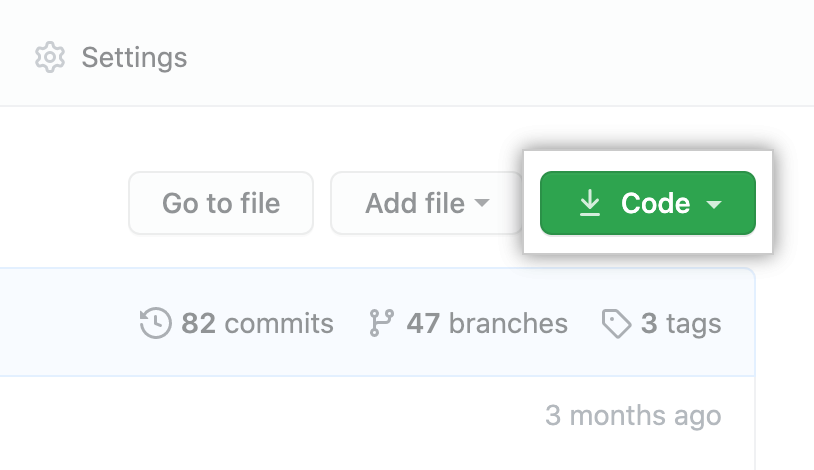
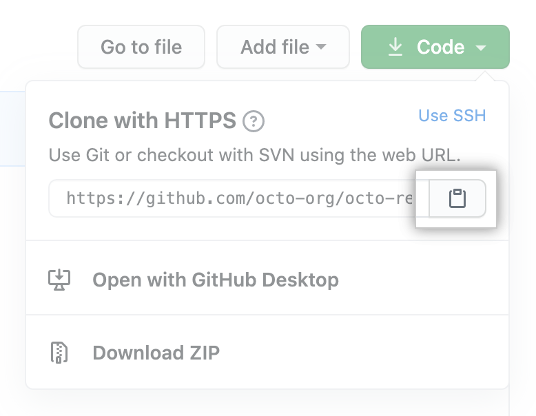

# User Creation Form

This is a sample user creation form that users can use to create new accounts. It was designed to be clean, simple, and easy to use.

## Tech/Framework Used

Built with:

-   React
-   Tailwind
-   Sass
-   MUI
-   Axios

## Installation

Here is a quick guide on how to get this form up and running.

### Cloning the repository

1. Above the list of files on this Repo, click **Code**.

    

2. To clone the repository using HTTPS, under "Clone with HTTPS", click the clipboard icon to the right of the URL. To clone the repository using an SSH key, including a certificate issued by your organization's SSH certificate authority, click Use SSH, then click the clickboard icon to the right of the URL. To clone a repository using GitHub CLI, click **Use GitHub CLI**, then click the clickboard icon to the right of the URL.

    
    

3. Open Terminal.
4. Change the current working directory to the location where you want the cloned directory.
5. Type `git clone`, and then paste the URL you copied earlier.

    `$ git clone https://github.com/YOUR-USERNAME/YOUR-REPOSITORY`

6. Press **Enter** to create your local clone.

```
$ git clone https://github.com/YOUR-USERNAME/YOUR-REPOSITORY
> Cloning into `Spoon-Knife`...
> remote: Counting objects: 10, done.
> remote: Compressing objects: 100% (8/8), done.
> remove: Total 10 (delta 1), reused 10 (delta 1)
> Unpacking objects: 100% (10/10), done.
```

### Running Application

Navigate to the your newly cloned repository and enter `npm start` to run.

## Credits

Thank you to the awesome team at Fetch Rewards for this amazing opportunity. I couldn't have done it without you!
